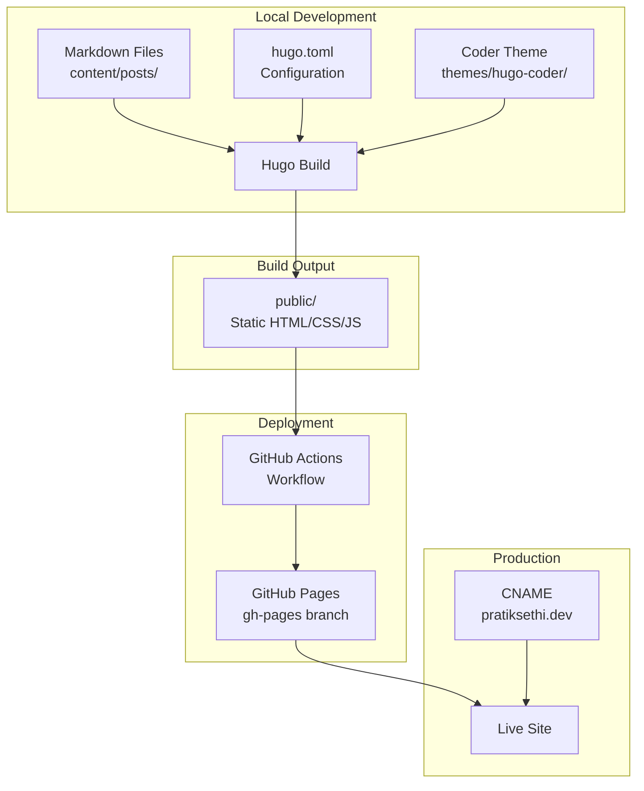

# Design Document: Hugo Blog Setup

## Overview

This design describes the implementation of a personal blog at pratiksethi.dev using Hugo static site generator with the Coder theme. The solution migrates existing markdown content, configures GitHub Pages deployment via GitHub Actions, and establishes a clean URL structure for blog posts.

The design prioritizes simplicity and minimal configuration while meeting all requirements for a functional developer blog.

## Architecture



### Directory Structure

```
pratiksethi.github.io/
├── .github/
│   └── workflows/
│       └── deploy.yml          # GitHub Actions workflow
├── archetypes/
│   └── default.md              # Template for new posts
├── content/
│   └── posts/                  # Blog posts (migrated + new)
│       ├── hello-world.md
│       └── how-i-built-this-site.md
├── static/
│   └── CNAME                   # Custom domain file
├── themes/
│   └── hugo-coder/             # Git submodule
├── hugo.toml                   # Hugo configuration
└── README.md                   # Development instructions
```

## Components and Interfaces

### 1. Hugo Configuration (hugo.toml)

The central configuration file that defines site behavior, theme settings, and URL structure.

```toml
baseURL = "https://pratiksethi.dev/"
languageCode = "en-us"
title = "Pratik Sethi"
theme = "hugo-coder"

# URL structure: /posts/<slug>/
[permalinks]
  posts = "/posts/:slug/"

# Enable tags taxonomy
[taxonomies]
  tag = "tags"

# Theme-specific parameters
[params]
  author = "Pratik Sethi"
  description = "Software engineer sharing learnings and thoughts"
  
  # Social links
  [[params.social]]
    name = "GitHub"
    icon = "fa-brands fa-github"
    url = "https://github.com/pratiksethi"
  
  [[params.social]]
    name = "LinkedIn"
    icon = "fa-brands fa-linkedin"
    url = "https://linkedin.com/in/pratiksethi"

# Navigation menu
[[menu.main]]
  name = "Posts"
  url = "/posts/"
  weight = 1

[[menu.main]]
  name = "Tags"
  url = "/tags/"
  weight = 2
```

### 2. Content Structure

Blog posts live in `content/posts/` with Hugo-compatible frontmatter:

```yaml
---
title: "Post Title"
description: "Brief description for SEO and previews"
date: 2025-01-04
tags: ["tag1", "tag2"]
draft: false
slug: "custom-url-slug"  # Optional: overrides filename
---
```

**Frontmatter Field Mapping:**
| Field | Purpose | Required |
|-------|---------|----------|
| title | Display title | Yes |
| description | Meta description, previews | Yes |
| date | Publication date, sorting | Yes |
| tags | Categorization, filtering | No |
| draft | Exclude from production | No (default: false) |
| slug | Custom URL path | No (default: filename) |

### 3. Theme Integration (hugo-coder)

The Coder theme is added as a Git submodule for easy updates:

```bash
git submodule add https://github.com/luizdepra/hugo-coder.git themes/hugo-coder
```

Theme provides:
- Responsive layout with mobile support
- Code syntax highlighting (via Chroma)
- Dark/light mode toggle
- Social icons (Font Awesome)
- Tag pages and navigation

### 4. GitHub Actions Workflow

Automated deployment on push to main branch:

```yaml
name: Deploy Hugo site to GitHub Pages

on:
  push:
    branches: [main]
  workflow_dispatch:

permissions:
  contents: read
  pages: write
  id-token: write

concurrency:
  group: "pages"
  cancel-in-progress: false

jobs:
  build:
    runs-on: ubuntu-latest
    steps:
      - uses: actions/checkout@v4
        with:
          submodules: recursive
      
      - name: Setup Hugo
        uses: peaceiris/actions-hugo@v3
        with:
          hugo-version: 'latest'
          extended: true
      
      - name: Build
        run: hugo --minify
      
      - name: Upload artifact
        uses: actions/upload-pages-artifact@v3
        with:
          path: ./public

  deploy:
    environment:
      name: github-pages
      url: ${{ steps.deployment.outputs.page_url }}
    runs-on: ubuntu-latest
    needs: build
    steps:
      - name: Deploy to GitHub Pages
        id: deployment
        uses: actions/deploy-pages@v4
```

### 5. Content Migration Component

Existing posts in `blog/` are migrated to `content/posts/` with these transformations:

| Source | Destination | Changes |
|--------|-------------|---------|
| `blog/why-this-blog-exists.md` | `content/posts/hello-world.md` | Rename for cleaner slug |
| `blog/001-how-i-built-this-site.md` | `content/posts/how-i-built-this-site.md` | Remove numeric prefix |

Frontmatter is preserved as-is since it's already Hugo-compatible.

## Data Models

### Post Frontmatter Schema

```typescript
interface PostFrontmatter {
  title: string;           // Required: Display title
  description: string;     // Required: Meta description
  date: Date;              // Required: Publication date (YYYY-MM-DD)
  lastUpdated?: Date;      // Optional: Last modification date
  tags?: string[];         // Optional: Array of tag strings
  draft?: boolean;         // Optional: Default false
  slug?: string;           // Optional: Custom URL slug
}
```

### Hugo Configuration Schema

```typescript
interface HugoConfig {
  baseURL: string;         // "https://pratiksethi.dev/"
  languageCode: string;    // "en-us"
  title: string;           // "Pratik Sethi"
  theme: string;           // "hugo-coder"
  
  permalinks: {
    posts: string;         // "/posts/:slug/"
  };
  
  taxonomies: {
    tag: string;           // "tags"
  };
  
  params: {
    author: string;
    description: string;
    social: SocialLink[];
  };
  
  menu: {
    main: MenuItem[];
  };
}

interface SocialLink {
  name: string;
  icon: string;
  url: string;
}

interface MenuItem {
  name: string;
  url: string;
  weight: number;
}
```

### Build Output Structure

```typescript
interface BuildOutput {
  // Generated for each post
  posts: {
    [slug: string]: {
      indexHtml: string;   // /posts/<slug>/index.html
    };
  };
  
  // Generated taxonomy pages
  tags: {
    indexHtml: string;     // /tags/index.html
    [tag: string]: {
      indexHtml: string;   // /tags/<tag>/index.html
    };
  };
  
  // Root files
  indexHtml: string;       // /index.html (homepage)
  cname: string;           // /CNAME
}
```


## Correctness Properties

*A property is a characteristic or behavior that should hold true across all valid executions of a system—essentially, a formal statement about what the system should do. Properties serve as the bridge between human-readable specifications and machine-verifiable correctness guarantees.*

### Property 1: Build Output Generation

*For any* valid Hugo project with at least one non-draft post, building the site SHALL produce an `index.html` file in the `public/` directory and corresponding HTML files for each post.

**Validates: Requirements 1.2**

### Property 2: URL Structure Compliance

*For any* published blog post, the generated URL path SHALL match the pattern `/posts/<slug>/` and SHALL NOT contain date components (year, month, day).

**Validates: Requirements 3.1, 3.4**

### Property 3: Slug Resolution

*For any* blog post, the URL slug SHALL be derived from the frontmatter `slug` field if present, otherwise from the filename (without extension). Custom slugs SHALL always take precedence over filename-derived slugs.

**Validates: Requirements 3.2, 3.3**

### Property 4: Draft Exclusion

*For any* post with `draft: true` in frontmatter, the post SHALL NOT appear in the production build output (when built without the `-D` flag).

**Validates: Requirements 4.3**

### Property 5: Content Preservation (Round-Trip)

*For any* migrated blog post, all original frontmatter fields (title, description, date, tags, draft) SHALL be preserved, and the markdown body content SHALL be identical to the source.

**Validates: Requirements 4.1, 4.4**

### Property 6: Post Ordering

*For any* list page displaying multiple posts, the posts SHALL be sorted by date in descending order (newest first).

**Validates: Requirements 5.2**

### Property 7: Tag Page Generation

*For any* tag used in at least one published post, a dedicated tag page SHALL exist at `/tags/<tag>/` containing links to all posts with that tag.

**Validates: Requirements 5.4**

### Property 8: CNAME Preservation

*For any* build of the site, the `CNAME` file containing `pratiksethi.dev` SHALL be present in the build output directory.

**Validates: Requirements 7.4**

### Property 9: Draft Preview in Development

*For any* post with `draft: true`, when Hugo is run with the `-D` (drafts) flag, the post SHALL be included in the generated output.

**Validates: Requirements 8.2**

### Property 10: Content Format Support

*For any* file in the content directory with valid frontmatter, Hugo SHALL process it regardless of whether it is a `.md` (markdown) or `.html` file. Static files (JS, CSS, images) placed in `static/` SHALL be copied to the build output.

**Validates: Requirements 9.1, 9.2, 9.3, 9.4, 9.5**

## Error Handling

### Build Errors

| Error Condition | Handling |
|-----------------|----------|
| Invalid frontmatter YAML | Hugo exits with parse error, build fails |
| Missing required frontmatter (title, date) | Hugo may build but page displays incorrectly |
| Theme not found | Hugo exits with "theme not found" error |
| Invalid config syntax | Hugo exits with config parse error |

### Deployment Errors

| Error Condition | Handling |
|-----------------|----------|
| Hugo build fails in CI | GitHub Actions job fails, deployment skipped |
| Missing CNAME file | Custom domain stops working |
| Submodule not initialized | Theme missing, build fails |

### Content Errors

| Error Condition | Handling |
|-----------------|----------|
| Duplicate slugs | Hugo warns, may overwrite files |
| Invalid date format | Hugo may fail to parse, uses file mod time |
| Missing content directory | Hugo creates empty site |

## Testing Strategy

### Manual Verification Checklist

Since Hugo is a static site generator with well-tested core functionality, testing focuses on configuration verification:

1. **Local Build Test**
   ```bash
   hugo --minify
   # Verify: public/ directory created with HTML files
   ```

2. **Draft Exclusion Test**
   ```bash
   hugo --minify
   # Verify: draft posts NOT in public/posts/
   hugo --minify -D
   # Verify: draft posts ARE in public/posts/
   ```

3. **URL Structure Test**
   ```bash
   hugo --minify
   # Verify: public/posts/<slug>/index.html exists for each post
   # Verify: No date components in paths
   ```

4. **CNAME Preservation Test**
   ```bash
   hugo --minify
   # Verify: public/CNAME exists and contains "pratiksethi.dev"
   ```

5. **Tag Pages Test**
   ```bash
   hugo --minify
   # Verify: public/tags/index.html exists
   # Verify: public/tags/<tag>/index.html exists for each used tag
   ```

### Development Workflow Testing

```bash
# Start dev server with drafts
hugo server -D

# Verify in browser:
# - Homepage loads at localhost:1313
# - Posts accessible at /posts/<slug>/
# - Draft posts visible
# - Live reload works on file changes
```

### CI/CD Verification

After pushing to main:
1. Check GitHub Actions workflow runs successfully
2. Verify site is accessible at https://pratiksethi.dev
3. Verify all posts render correctly
4. Verify custom domain works (HTTPS enabled)

### Property-Based Testing Consideration

For this project, property-based testing is not practical because:
- Hugo is a mature, well-tested tool
- Configuration is declarative (TOML), not programmatic
- Most properties are verified by Hugo's own build process
- Testing would require mocking Hugo's internals

Instead, the testing strategy relies on:
- Hugo's built-in validation during build
- Manual verification of output structure
- CI/CD pipeline success as integration test
